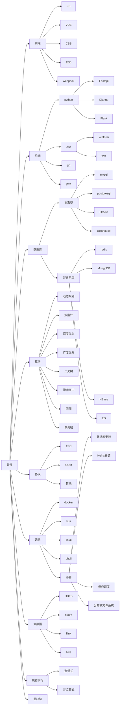
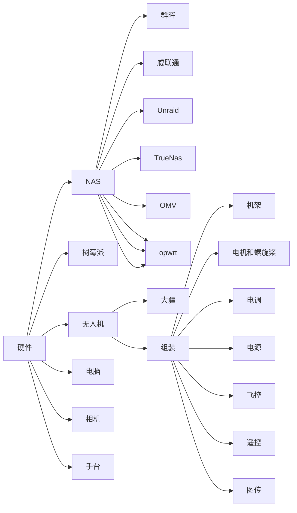
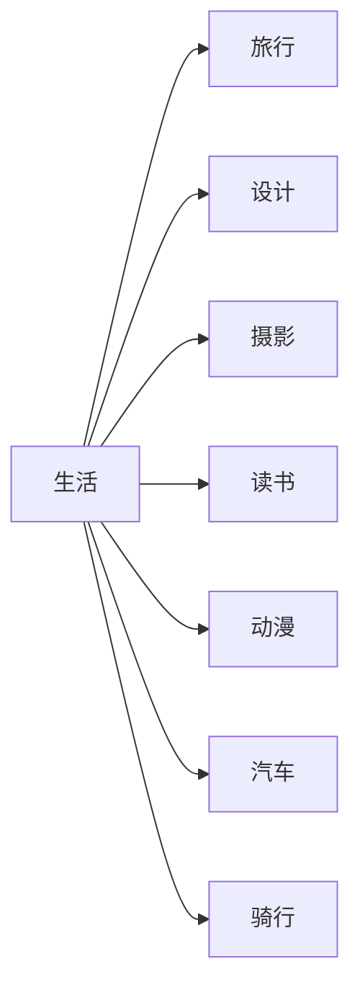

# 技术栈

## 软件

```mermaid 
graph LR
A[软件] --> A1[前端]
A1 --> A11[JS]
A1 --> A12[VUE]
A1 --> A13[CSS]
A1 --> A14[ES6]
A1 --> A15[webpack]
A[软件] --> A2[后端]
A2 --> A21[python]
A21 --> A211[Fastapi]
A21 --> A212[Django]
A21 --> A213[Flask]
A2 --> A22[.net]
A22 --> A221[winform]
A22 --> A222[wpf]
A2 --> A23[go]
A2 --> A24[java]
A[软件] --> A3[数据库]
A3 --> A31[关系型]
A31 --> A311[mysql]
A31 --> A312[postgresql]
A31 --> A313[Oracle]
A31 --> A314[clickhouse]
A3 --> A32[非关系型]
A32 --> A321[redis]
A32 --> A322[MongoDB]
A32 --> A323[HBase]
A32 --> A324[ES]
A[软件] --> A4[算法]
A4 --> A41[动态规划]
A4 --> A42[双指针]
A4 --> A43[深度优先]
A4 --> A44[广度优先]
A4 --> A45[二叉树]
A4 --> A46[滑动窗口]
A4 --> A47[回溯]
A4 --> A48[单调栈]
A[软件] --> A5[协议]
A5 --> A51[TPC]
A5 --> A52[COM]
A5 --> A53[其他]
A[软件] --> A6[运维]
A6 --> A61[docker]
A6 --> A62[k8s]
A6 --> A63[linux]
A6 --> A64[shell]
A6 --> A65[部署]
A65 --> A651[数据库安装]
A65 --> A652[Nginx安装]
A65 --> A653[任务调度]
A65 --> A654[分布式文件系统]
A[软件] --> A7[大数据]
A7 --> A71[HDFS]
A7 --> A72[spark]
A7 --> A73[flink]
A7 --> A74[hive]
A[软件] --> A8[机器学习]
A8 --> A81[监督式]
A8 --> A82[非监督式]
A[软件] --> A9[区块链]
```

## 硬件

```mermaid
graph LR
A[硬件] --> A1[NAS]
A1 --> A11[群晖]
A1 --> A12[威联通]
A1 --> A13[Unraid]
A1 --> A14[TrueNas]
A1 --> A15[OMV]
A1 --> A16[绿联]
A1 --> A16[极空间]
A1 --> A16[opwrt]
A[硬件] --> A2[树莓派]
A[硬件] --> A3[无人机]
A3 --> A31[大疆]
A3 --> A32[组装]
A32 --> A321[机架]
A32 --> A322[电机和螺旋桨]
A32 --> A323[电调]
A32 --> A324[电源]
A32 --> A325[飞控]
A32 --> A326[遥控]
A32 --> A327[图传]
A[硬件] --> A4[电脑]
A[硬件] --> A5[相机]
A[硬件] --> A6[手台]
```

## 生活

```mermaid
graph LR
A[生活] --> A1[旅行]
A[生活] --> A2[设计]
A[生活] --> A3[摄影]
A[生活] --> A4[读书]
A[生活] --> A5[动漫]
A[生活] --> A6[汽车]
A[生活] --> A7[骑行]
```